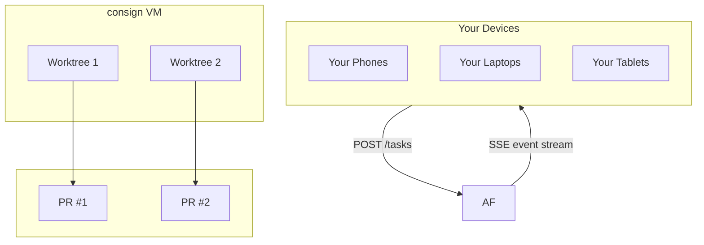

<picture>
  <source media="(prefers-color-scheme: dark)" srcset="https://img.shields.io/badge/consign-v0.1.0-6C5CE7?style=for-the-badge&logo=data:image/svg+xml;base64,PHN2ZyB3aWR0aD0iNDAiIGhlaWdodD0iNDAiIHZpZXdCb3g9IjAgMCA0MCA0MCIgZmlsbD0ibm9uZSIgeG1sbnM9Imh0dHA6Ly93d3cudzMub3JnLzIwMDAvc3ZnIj48Y2lyY2xlIGN4PSIyMCIgY3k9IjIwIiByPSIxOCIgc3Ryb2tlPSIjNkM1Q0U3IiBzdHJva2Utd2lkdGg9IjIiLz48cGF0aCBkPSJNMTIgMjBsNiA2IDEwLTEwIiBzdHJva2U9IiM2QzVDRTciIHN0cm9rZS13aWR0aD0iMiIgc3Ryb2tlLWxpbmVjYXA9InJvdW5kIiBzdHJva2UtbGluZWpvaW49InJvdW5kIi8+PC9zdmc+">
  
</picture>

<h1 align="center">consign</h1>

<p align="center">
  <em>Self-hosted remote AI coding agent orchestrator.</em><br>
  Dispatch tasks from any device → agents implement them → review as PRs.
</p>

<p align="center">
  
  
  
</p>

---



---

## Features

- **Agent-agnostic** — Claude Code (native SDK), OpenCode, Aider, Cline, Copilot CLI
- **Isolated execution** — each task in its own `git worktree`
- **Real-time SSE streaming** — watch agents work from any browser
- **Resumable sessions** — send follow-ups from any device via `session_id`
- **Preflight checks** — Haiku classifies complexity; complex tasks need approval
- **Auto PRs** — agent commits, pushes, opens a GitHub PR when done
- **Single binary** — `bun build --compile`
- **Auto-discovery** — `consign init` stamps any repo with a `.consign.json` sign file; the server auto-discovers projects by scanning workspace roots

## Docs

- [Getting Started](docs/GETTING_STARTED.md) — install, configure, first task
- [API Reference](docs/API.md) — all endpoints with examples
- [Architecture](docs/ARCHITECTURE.md) — agent adapter, worktree isolation, data model
- [Deployment](docs/DEPLOYMENT.md) — system service, environment variables

## Quick Start

```bash
# One-liner install (macOS ARM) — no toolchain required
curl -L https://github.com/<your-org>/consign/releases/latest/download/consign-darwin-arm64 \
  -o /usr/local/bin/consign && chmod +x /usr/local/bin/consign

# Stamp any repo
consign init

# Start the server
consign
```

Or build from source: `git clone <repo> && cd consign && bun install && bun run build`

Full guide → [docs/GETTING_STARTED.md](docs/GETTING_STARTED.md)

## Philosophy

consign is **pure infrastructure**. It knows nothing about your project's stack. It takes a task description, spawns an agent in an isolated worktree, streams the output, and opens a PR. You bring the projects, agents, and review process.
