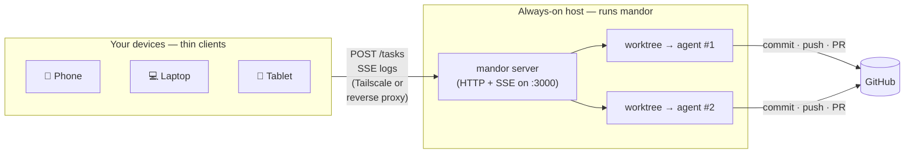

<picture>
  <source media="(prefers-color-scheme: dark)" srcset="https://img.shields.io/badge/mandor-v0.3.0-6C5CE7?style=for-the-badge&logo=data:image/svg+xml;base64,PHN2ZyB3aWR0aD0iNDAiIGhlaWdodD0iNDAiIHZpZXdCb3g9IjAgMCA0MCA0MCIgZmlsbD0ibm9uZSIgeG1sbnM9Imh0dHA6Ly93d3cudzMub3JnLzIwMDAvc3ZnIj48Y2lyY2xlIGN4PSIyMCIgY3k9IjIwIiByPSIxOCIgc3Ryb2tlPSIjNkM1Q0U3IiBzdHJva2Utd2lkdGg9IjIiLz48cGF0aCBkPSJNMTIgMjBsNiA2IDEwLTEwIiBzdHJva2U9IiM2QzVDRTciIHN0cm9rZS13aWR0aD0iMiIgc3Ryb2tlLWxpbmVjYXA9InJvdW5kIiBzdHJva2UtbGluZWpvaW49InJvdW5kIi8+PC9zdmc+">
  
</picture>

<h1 align="center">mandor</h1>

<p align="center">
  <em>A self-hosted server that turns AI coding agents into an always-on crew you dispatch from any device.</em>
</p>

<p align="center">
  
  
  
</p>

---

## What is mandor?

**mandor** is a small self-hosted server that runs AI coding agents (Claude Code, OpenCode, Aider, …) on your behalf. You send it a task from *any* device — your phone, a laptop, a tablet — and it spins up an agent inside an isolated copy of your repo, lets the agent do the work, and opens a Pull Request when it's done. You watch it happen live and review the PR wherever you are.

The name comes from Indonesian: a **mandor** is a construction *foreman* — the person who takes the owner's orders, dispatches the crew, oversees the job, and hands back the finished work. That's exactly the role this tool plays between you and your AI agents.

> mandor is **pure infrastructure**. It knows nothing about your stack. It takes a task, runs an agent in a worktree, streams the output, and opens a PR. You bring the repos, the agents, and the review process.

## The problem

AI coding agents are powerful, but today they're **tethered to your laptop**:

- You have to be sitting at your machine, terminal open, watching it work.
- Your laptop has to stay awake and online for the whole run.
- There's no clean way to say *"build feature X"* **from your phone** while you're away — and come back to a PR.
- Running several agents in parallel, across several repos, is manual and chaotic.

mandor moves the agent execution off your laptop and onto an **always-on host** you control, exposed over your network. Your devices become thin clients that just send tasks and watch progress.

## How it works



1. **The host** is an always-on machine (a cloud VM, a home server, a Mac mini — anything that stays up). It holds your cloned repos, your git/GitHub credentials, your agent API keys, and the agent runtimes.
2. **mandor** runs there as a single binary, serving HTTP on a port.
3. **Your devices** reach that port over your network (a private [Tailscale](https://tailscale.com) mesh is the easy path; or a public reverse proxy with TLS) and send tasks.
4. For each task, mandor creates an isolated **git worktree**, runs the agent inside it, **streams** progress back to you over SSE, and the agent **commits, pushes, and opens a PR**.
5. You review and merge the PR from anywhere. (Merge can optionally trigger a deploy.)

## Common use cases

- **Dispatch from your phone.** On the train, send *"add password reset to the auth service"* → by the time you're home there's a PR waiting.
- **Run agents in parallel.** Three tasks, three isolated worktrees, three PRs — without juggling terminals.
- **Always-on repo minion.** Burn down a backlog or a pile of `good-first-issue`s on a box that never sleeps.
- **Iterate mid-task.** Reply to a running task (*"also add rate limiting"*) and the agent continues with full context.
- **Self-hosted, private, agent-agnostic.** Your code and keys stay on your own host; swap agents per project.

## Features

- **Agent-agnostic** — Claude Code (native SDK), OpenCode, Aider, Cline, Copilot CLI
- **Isolated execution** — each task in its own `git worktree`; agents never touch `main`
- **Real-time SSE streaming** — watch agents work from any browser/device
- **Resumable sessions** — send follow-ups from any device via `session_id`
- **Preflight checks** — a fast model classifies complexity; complex tasks wait for your approval
- **Auto PRs** — the agent commits, pushes, and opens a GitHub PR when done
- **Single binary** — one self-contained executable, no runtime to install on the host
- **Auto-discovery** — `mandor init` stamps any repo with a `.mandor.json` sign file; the server auto-discovers projects by scanning workspace roots

## Quick start

> mandor runs on an **always-on host**, not on your phone. Pick a machine that stays on (a cloud VM is the typical choice), install it there, then dispatch tasks to it from anywhere.

**On the host** — install the binary and start the server:

```bash
# Linux x64 (common for cloud VMs) — see Getting Started for macOS / build-from-source
curl -L https://github.com/yanmii-inc/Mandor/releases/latest/download/mandor-linux-x64 \
  -o /usr/local/bin/mandor && chmod +x /usr/local/bin/mandor

cd ~/my-app && mandor init     # stamp the repo so mandor can discover it
mandor scan                    # register it with the server
mandor                         # start the server on :3000
```

**From any device** (once the host is reachable — see [Getting Started](docs/GETTING_STARTED.md) for the Tailscale setup):

```bash
curl -X POST http://<host>:3000/tasks \
  -H 'Content-Type: application/json' \
  -d '{"project_id":"<id>","description":"Add JWT authentication"}'

curl -N http://<host>:3000/tasks/<task-id>/logs   # watch it work, live
```

## Docs

- **[Getting Started](docs/GETTING_STARTED.md)** — the host + devices + network model, full prerequisites, and your first task end-to-end
- **[API Reference](docs/API.md)** — every endpoint with examples
- **[Architecture](docs/ARCHITECTURE.md)** — agent adapter, worktree isolation, preflight, data model
- **[Deployment](docs/DEPLOYMENT.md)** — systemd service, environment variables, networking (Tailscale / reverse proxy), security

## Philosophy

mandor is the foreman: it doesn't write code, it doesn't know your stack, and it doesn't pick your agents. It takes an order, dispatches the crew, keeps the worksite isolated and tidy, and delivers a reviewable PR. You stay the owner.
